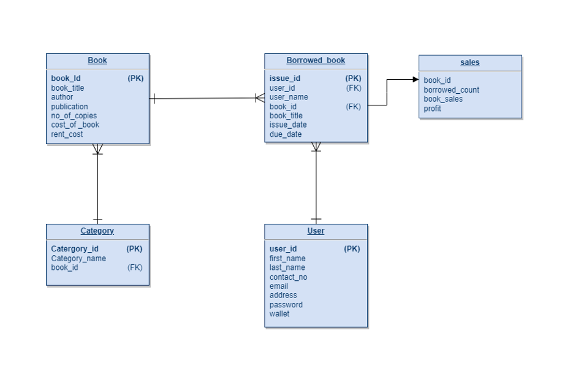
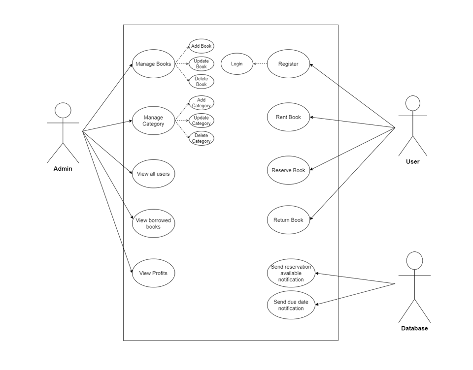

# Library Management System

## Overview

The Library Management System is a backend service built using **Spring Boot** and follows the **Microservice Architecture**. This system is designed to handle the management of books, users, rentals, and notifications for a library. The application is split into several microservices for scalability and ease of maintenance:

- **User Service**: Handles user management (registration, authentication, profile management, and wallet system).
- **Book Service**: Manages the books in the library (adding, updating, deleting, and searching books).
- **Rental Service**: Manages book rentals (book issuance, returns, due dates, etc.).
- **Notification Service**: Sends email notifications to users (for rental confirmations, due date reminders, and book availability alerts).

The system utilizes **Netflix Eureka** for service discovery, ensuring seamless communication between microservices. The database used is **PostgreSQL** for reliable data storage, and **Kafka** is employed for sending asynchronous email notifications to users.

Additionally, **Swagger (OpenAPI)** is integrated for API documentation, providing an easy way for developers to test and explore the endpoints.

Key features include:
- **Optimistic Locking**: To handle concurrency and prevent data inconsistencies during simultaneous updates.
- **Kafka-based Email Notifications**: Email notifications are sent asynchronously via Kafka to ensure decoupled and efficient communication.
- **Wallet System**: Users have a wallet linked to their account, which is debited whenever they rent a book.
- **Service Discovery**: Netflix Eureka helps in dynamically discovering and managing microservices.

## Key Use Cases

### 1. **User Wallet Management**
- When a user creates their account, they are provided with a wallet.
- Each time a user rents a book, the cost of the book is deducted from their wallet.
- If the user’s wallet balance is less than the book’s rental cost, they receive an alert message stating "Insufficient Balance."
- Users can view their available wallet balance in their profile section at any time.

### 2. **Due Date and Availability Notifications**
- Once a user borrows a book, they are provided with a due date to return it.
- If the user forgets to return the book on the due date, they will receive a notification reminding them to return it.
- If the requested book is unavailable because it has already been borrowed by another user, the user can opt to be notified when the book becomes available.
- Notifications are sent based on priority to ensure timely communication.

## Technologies Used

- **Spring Boot**: Framework for building microservices.
- **Netflix Eureka**: Service discovery for managing microservices.
- **PostgreSQL**: Relational database for persistent data storage.
- **Kafka**: Asynchronous messaging for email notifications.
- **Swagger (OpenAPI)**: API documentation and testing interface.
- **Java 11**: Java version used to build the application.

## Running Locally

### Prerequisites

- **Java 11**: Ensure you have Java 11 installed.
- **PostgreSQL**: Have a PostgreSQL database running locally or use a cloud-hosted database.
- **Kafka**: Ensure Kafka is set up and running on your local machine for message brokering.
- **Maven**: Use Maven to manage project dependencies.

### Steps to Run

1. **Clone the Repository**

   ```bash
   git clone https://github.com/JayaramKrishnaR/library-management-system.git
   cd library-management-system

2. **Setup PostgreSQL and Kafka**
3. **Build the Project**
    ```bash
   mvn clean install
4. **Run microservices**
5. **Access Swagger-UI**
   ```bash
   http://localhost:8080/swagger-ui.html

# Database schema




# UML diagram

